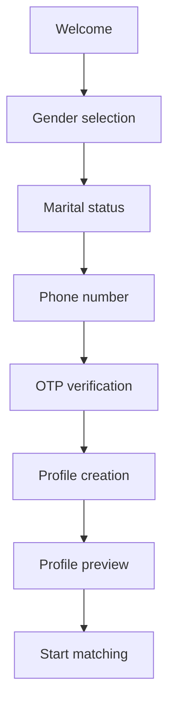
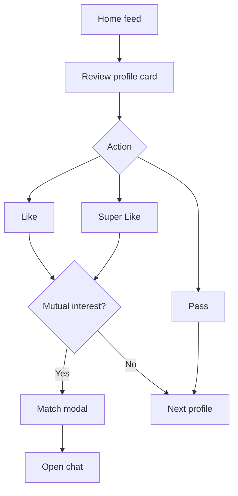
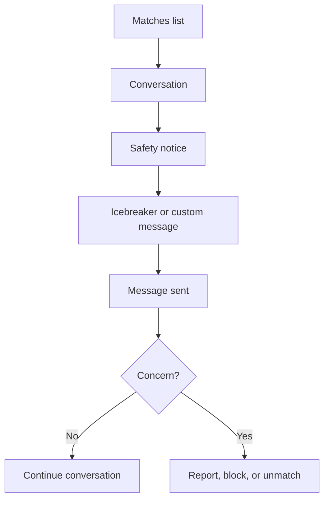
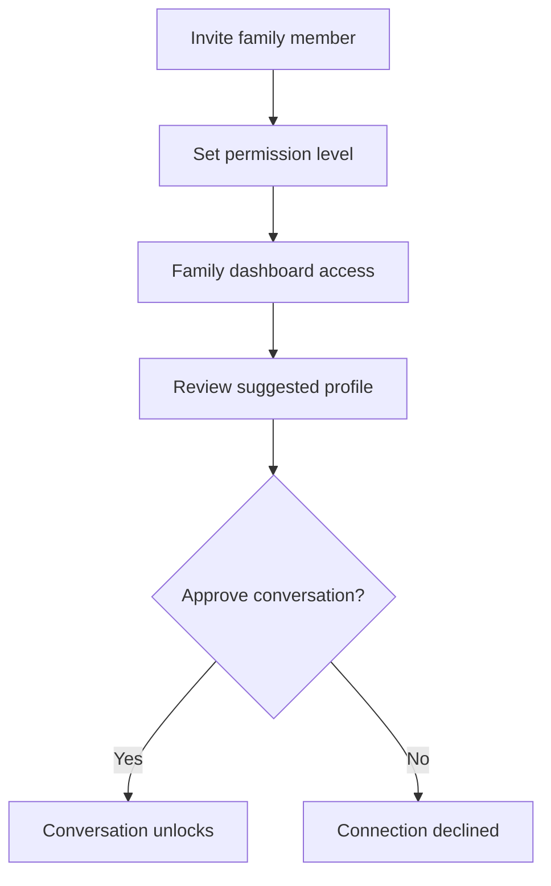
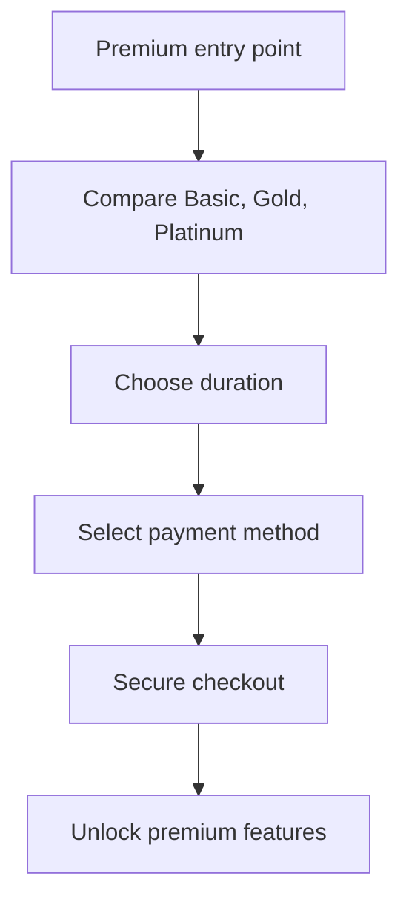

# Nikkah Noor User Flows

## Registration

```mermaid
flowchart TD
  A["Welcome"] --> B["Gender selection"]
  B --> C["Marital status"]
  C --> D["Phone number"]
  D --> E["OTP verification"]
  E --> F["Profile creation"]
  F --> G["Profile preview"]
  G --> H["Start matching"]
```

## Discovery And Matching

```mermaid
flowchart TD
  A["Home feed"] --> B["Review profile card"]
  B --> C{"Action"}
  C --> D["Pass"]
  C --> E["Like"]
  C --> F["Super Like"]
  E --> G{"Mutual interest?"}
  F --> G
  G -->|Yes| H["Match modal"]
  G -->|No| I["Next profile"]
  H --> J["Open chat"]
  D --> I
```

## Messaging

```mermaid
flowchart TD
  A["Matches list"] --> B["Conversation"]
  B --> C["Safety notice"]
  C --> D["Icebreaker or custom message"]
  D --> E["Message sent"]
  E --> F{"Concern?"}
  F -->|No| G["Continue conversation"]
  F -->|Yes| H["Report, block, or unmatch"]
```

## Family And Wali Approval

```mermaid
flowchart TD
  A["Invite family member"] --> B["Set permission level"]
  B --> C["Family dashboard access"]
  C --> D["Review suggested profile"]
  D --> E{"Approve conversation?"}
  E -->|Yes| F["Conversation unlocks"]
  E -->|No| G["Connection declined"]
```

## Premium Upgrade

```mermaid
flowchart TD
  A["Premium entry point"] --> B["Compare Basic, Gold, Platinum"]
  B --> C["Choose duration"]
  C --> D["Select payment method"]
  D --> E["Secure checkout"]
  E --> F["Unlock premium features"]
```
